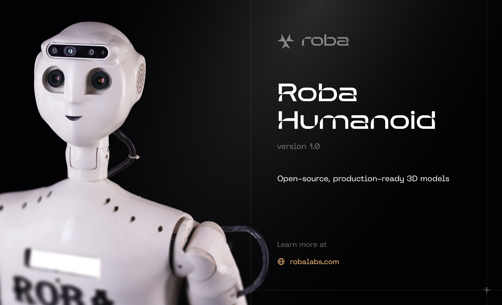

# Roba Robot

The ROBA AI Humanoid Robot is an early-stage prototype that demonstrates the first step toward our larger vision of Design-to-Doorstep Robotics. Even in its current form, it highlights how AI and robotics can merge to create a companion that walks, interacts, and assists in daily tasks. It can speak naturally, recognize faces and objects, navigate a mapped environment, and perform simple demonstrations such as grasping, cutting, or writing. These are not the end goals but the foundation for what comes next.

Aligned with our decentralized AI platform, ROBA-Studio — the next-gen simulator — and the open developer platform, ROBA Creator Hub, in line with our long-term vision. this humanoid is more than a standalone prototype — it is a flagship embodiment of the ROBA Developer Hub ecosystem. As the platform also evolves with cloud-first simulation, template libraries, and a marketplace of reusable robotics assets, the humanoid will continuously integrate these cutting-edge modules. Future versions will feature advanced actuators for smoother motion, multimodal sensing for richer perception, and large AI models for adaptive dialogue and task planning. Developers from around the world will be able to contribute new “skills” — from navigation to manipulation — through ROBA-Studio, instantly upgrading the humanoid’s abilities.

In this way, the ROBA Humanoid becomes both a practical assistant and a living showcase of the ROBALABs vision: a future where anyone can design a robot brain in the hub, select a humanoid shell, and have it delivered, ready to operate in the real world. 

## Showcase

 


## Features

- **Conversational AI:** Roba can understand and respond to voice commands, engage in conversations, and answer questions on a wide range of topics.
- **Computer Vision:** Equipped with a 3D camera, Roba can perceive its surroundings, detect objects and faces, and track movements.
- **Advanced Robotics:** Roba has a full range of motion with multiple servo motors controlling its hands, head, and other limbs.
- **Application-based Framework:** Roba's functionalities are organized into applications, allowing for modular and extensible development.
- **3D Models Included:** This repository also includes Roba’s 3D model files, which can be used for visualization, simulation, or design purposes; you can extend it with URDF/MJCF scripting.

## Project Structure

The repository is organized into the following directories:

- `datas/`: Contains data files used by the robot, such as training data for the chatbot and saved robot states.
- `libs/`: Contains external libraries and pre-trained models, such as the YOLOv5 model for object detection.
- `scr/`: Contains the source code for the robot's software, divided into the following subdirectories:
    - `Roba_conversion_ai/`: The conversational AI, including Automatic Speech Recognition (ASR), the chatbot, and text-to-speech (TTS).
    - `Roba_vision/`: The computer vision system, including camera control, object detection, face detection, and tracking.
    - `Robamain/`: The main control system for the robot, which integrates all the different components.
    - `firmware/`: The firmware for the robot's hardware, such as servos and LEDs.

## Getting Started

### Prerequisites

- A compatible hardware setup for the Roba robot.
- Python 3.6+
- The required Python libraries (see `requirements.txt`).
- **Note:** The `Jetson.GPIO` library is specific to NVIDIA Jetson platforms and may not be installable on other systems.

### Installation

1.  Clone this repository:
    ```bash
    git clone https://github.com/your-username/roba-robot.git
    ```
2.  Install the required Python libraries:
    ```bash
    pip install -r requirements.txt
    ```

### Running the Robot

To start the robot's main control program, run the following command:

```bash
python scr/Robamain/roba.py
```

This will initialize the robot's systems and start the conversational AI.

## Contributing

Contributions are welcome! Please feel free to submit a pull request or open an issue to discuss your ideas.
